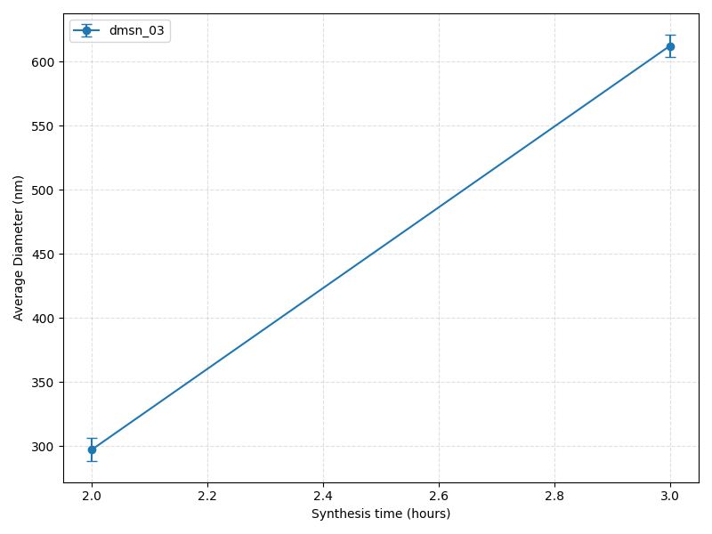
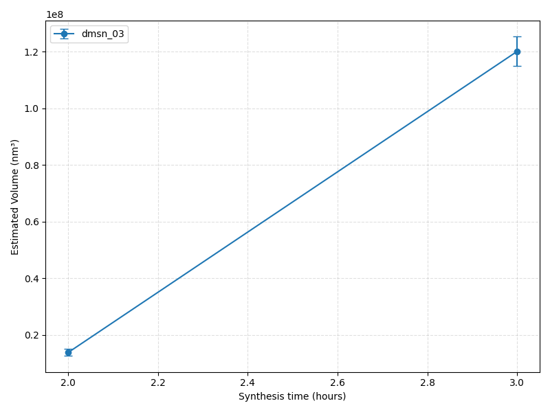

# Nanoparticle Analysis Report

Generated: 2026-05-28 13:49:26

## Summary Table

| Sample | Synthesis Time | Particles | Avg Diameter (nm) | Std Dev (nm) |
|---|---:|---:|---:|---:|
| dmsn_03 | 3 | 6 | 612.26 | 8.79 |
| dmsn_03 | 2 | 3 | 297.35 | 8.84 |

## Plots

### Average Diameter vs Time

### Estimated Volume vs Time

## Notes

- Verification images are saved in the Verification_Output folder under each sample/timepoint subfolder.
